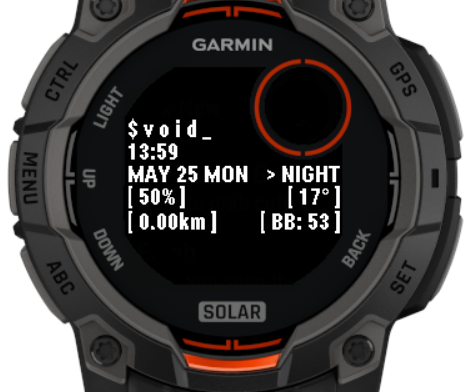

# Lonely void 🌃

A simple watchface for Garmin Instinct 3 Solar watches.

## Features

1. Very minimal interface
2. Displays essential data
3. Instinct circular subframe support

## Data fields

- Current time in 24-hour format
- Current date - month, day, day of the week
- Battery percent
- Distance covered today (in km)
- Current temperature
- Current Body battery level

## Supported watches

- Garmin Instinct 3 Solar 45mm/50mm

> [!NOTE]
> If you encounter misalignments or other bugs on those models, please reach out so I cat fix it. Also, please feel free to request additional features as I am planning to maintain this watchface. If you know how to add support for Instinct 2 series, any help is appreciated.

## Local build instructions

1. Make sure you have **Visual Studio Code** installed and **Monkey C** extension enabled
2. Download **Connect IQ SDK** from official [Garmin website](https://developer.garmin.com/connect-iq/sdk/) and go through the installation process (don`t forget to download desired devices for simulation)
3. Clone this repository
4. Open the repository folder in VS Code
5. Press `Ctrl+Shift+P` and find command `Monkey C: Verify installation`
6. Press `F5` to start the simulation and select the device
